Hotel Bookings Analysis (Google Data Analytics Capstone Project)
================
Olajumoke Tokode
2024-01-26

# Introduction

The aim of this analysis is to examine hotel bookings of two hotel
types, city and resort hotel, and to determine factors that affect
bookings variance between the two hotels.  
The hotel bookings dataset is obtained from kaggle. The hotels are
located in Portugal.  
Some questions to be answered from the dataset:  
1. What is the average, minimum and maximum lead time of the hotel
bookings.  
2. What is the average, maximum and minimum days customers have to wait
for both hotels.  
3. What is the percentage of customer type bookings by city and resort
hotel.  
4. Which month between the year 2015 and 2017 has the highest number of
bookings.  
5. Top 8 countries with the highest bookings for city and resort
hotel.  

Also, analysis on the average daily rate, market segments, distribution
channels, deposit type, previous cancellations and if customers were
repeated guests, reserved and assigned room types of both hotels will be
carried out.  

# Setting up my environment

Setting up my R environment by loading the ‘tidyverse’, ‘skimr’,
‘janitor’ and ‘ggplot2’ packages:

``` r
library(tidyverse)
```

    ## ── Attaching core tidyverse packages ──────────────────────── tidyverse 2.0.0 ──
    ## ✔ dplyr     1.1.4     ✔ readr     2.1.4
    ## ✔ forcats   1.0.0     ✔ stringr   1.5.1
    ## ✔ ggplot2   3.4.4     ✔ tibble    3.2.1
    ## ✔ lubridate 1.9.3     ✔ tidyr     1.3.0
    ## ✔ purrr     1.0.2     
    ## ── Conflicts ────────────────────────────────────────── tidyverse_conflicts() ──
    ## ✖ dplyr::filter() masks stats::filter()
    ## ✖ dplyr::lag()    masks stats::lag()
    ## ℹ Use the conflicted package (<http://conflicted.r-lib.org/>) to force all conflicts to become errors

``` r
library(skimr)
library(janitor)
```

    ## 
    ## Attaching package: 'janitor'
    ## 
    ## The following objects are masked from 'package:stats':
    ## 
    ##     chisq.test, fisher.test

``` r
library(ggplot2)
```

# Data Preparation

Import the hotel bookings dataset into ‘R’ and print the first few rows
of the dataset.  

``` r
bookings_df <- read_csv("hotel_bookings.csv")
```

    ## Rows: 119390 Columns: 32
    ## ── Column specification ────────────────────────────────────────────────────────
    ## Delimiter: ","
    ## chr  (13): hotel, arrival_date_month, meal, country, market_segment, distrib...
    ## dbl  (18): is_canceled, lead_time, arrival_date_year, arrival_date_week_numb...
    ## date  (1): reservation_status_date
    ## 
    ## ℹ Use `spec()` to retrieve the full column specification for this data.
    ## ℹ Specify the column types or set `show_col_types = FALSE` to quiet this message.

``` r
head(bookings_df)
```

    ## # A tibble: 6 × 32
    ##   hotel        is_canceled lead_time arrival_date_year arrival_date_month
    ##   <chr>              <dbl>     <dbl>             <dbl> <chr>             
    ## 1 Resort Hotel           0       342              2015 July              
    ## 2 Resort Hotel           0       737              2015 July              
    ## 3 Resort Hotel           0         7              2015 July              
    ## 4 Resort Hotel           0        13              2015 July              
    ## 5 Resort Hotel           0        14              2015 July              
    ## 6 Resort Hotel           0        14              2015 July              
    ## # ℹ 27 more variables: arrival_date_week_number <dbl>,
    ## #   arrival_date_day_of_month <dbl>, stays_in_weekend_nights <dbl>,
    ## #   stays_in_week_nights <dbl>, adults <dbl>, children <dbl>, babies <dbl>,
    ## #   meal <chr>, country <chr>, market_segment <chr>,
    ## #   distribution_channel <chr>, is_repeated_guest <dbl>,
    ## #   previous_cancellations <dbl>, previous_bookings_not_canceled <dbl>,
    ## #   reserved_room_type <chr>, assigned_room_type <chr>, …

List all column names of the dataset

``` r
colnames(bookings_df)
```

    ##  [1] "hotel"                          "is_canceled"                   
    ##  [3] "lead_time"                      "arrival_date_year"             
    ##  [5] "arrival_date_month"             "arrival_date_week_number"      
    ##  [7] "arrival_date_day_of_month"      "stays_in_weekend_nights"       
    ##  [9] "stays_in_week_nights"           "adults"                        
    ## [11] "children"                       "babies"                        
    ## [13] "meal"                           "country"                       
    ## [15] "market_segment"                 "distribution_channel"          
    ## [17] "is_repeated_guest"              "previous_cancellations"        
    ## [19] "previous_bookings_not_canceled" "reserved_room_type"            
    ## [21] "assigned_room_type"             "booking_changes"               
    ## [23] "deposit_type"                   "agent"                         
    ## [25] "company"                        "days_in_waiting_list"          
    ## [27] "customer_type"                  "adr"                           
    ## [29] "required_car_parking_spaces"    "total_of_special_requests"     
    ## [31] "reservation_status"             "reservation_status_date"

Show a glimpse of the dataset

``` r
glimpse(bookings_df)
```

    ## Rows: 119,390
    ## Columns: 32
    ## $ hotel                          <chr> "Resort Hotel", "Resort Hotel", "Resort…
    ## $ is_canceled                    <dbl> 0, 0, 0, 0, 0, 0, 0, 0, 1, 1, 1, 0, 0, …
    ## $ lead_time                      <dbl> 342, 737, 7, 13, 14, 14, 0, 9, 85, 75, …
    ## $ arrival_date_year              <dbl> 2015, 2015, 2015, 2015, 2015, 2015, 201…
    ## $ arrival_date_month             <chr> "July", "July", "July", "July", "July",…
    ## $ arrival_date_week_number       <dbl> 27, 27, 27, 27, 27, 27, 27, 27, 27, 27,…
    ## $ arrival_date_day_of_month      <dbl> 1, 1, 1, 1, 1, 1, 1, 1, 1, 1, 1, 1, 1, …
    ## $ stays_in_weekend_nights        <dbl> 0, 0, 0, 0, 0, 0, 0, 0, 0, 0, 0, 0, 0, …
    ## $ stays_in_week_nights           <dbl> 0, 0, 1, 1, 2, 2, 2, 2, 3, 3, 4, 4, 4, …
    ## $ adults                         <dbl> 2, 2, 1, 1, 2, 2, 2, 2, 2, 2, 2, 2, 2, …
    ## $ children                       <dbl> 0, 0, 0, 0, 0, 0, 0, 0, 0, 0, 0, 0, 0, …
    ## $ babies                         <dbl> 0, 0, 0, 0, 0, 0, 0, 0, 0, 0, 0, 0, 0, …
    ## $ meal                           <chr> "BB", "BB", "BB", "BB", "BB", "BB", "BB…
    ## $ country                        <chr> "PRT", "PRT", "GBR", "GBR", "GBR", "GBR…
    ## $ market_segment                 <chr> "Direct", "Direct", "Direct", "Corporat…
    ## $ distribution_channel           <chr> "Direct", "Direct", "Direct", "Corporat…
    ## $ is_repeated_guest              <dbl> 0, 0, 0, 0, 0, 0, 0, 0, 0, 0, 0, 0, 0, …
    ## $ previous_cancellations         <dbl> 0, 0, 0, 0, 0, 0, 0, 0, 0, 0, 0, 0, 0, …
    ## $ previous_bookings_not_canceled <dbl> 0, 0, 0, 0, 0, 0, 0, 0, 0, 0, 0, 0, 0, …
    ## $ reserved_room_type             <chr> "C", "C", "A", "A", "A", "A", "C", "C",…
    ## $ assigned_room_type             <chr> "C", "C", "C", "A", "A", "A", "C", "C",…
    ## $ booking_changes                <dbl> 3, 4, 0, 0, 0, 0, 0, 0, 0, 0, 0, 0, 0, …
    ## $ deposit_type                   <chr> "No Deposit", "No Deposit", "No Deposit…
    ## $ agent                          <chr> "NULL", "NULL", "NULL", "304", "240", "…
    ## $ company                        <chr> "NULL", "NULL", "NULL", "NULL", "NULL",…
    ## $ days_in_waiting_list           <dbl> 0, 0, 0, 0, 0, 0, 0, 0, 0, 0, 0, 0, 0, …
    ## $ customer_type                  <chr> "Transient", "Transient", "Transient", …
    ## $ adr                            <dbl> 0.00, 0.00, 75.00, 75.00, 98.00, 98.00,…
    ## $ required_car_parking_spaces    <dbl> 0, 0, 0, 0, 0, 0, 0, 0, 0, 0, 0, 0, 0, …
    ## $ total_of_special_requests      <dbl> 0, 0, 0, 0, 1, 1, 0, 1, 1, 0, 0, 0, 3, …
    ## $ reservation_status             <chr> "Check-Out", "Check-Out", "Check-Out", …
    ## $ reservation_status_date        <date> 2015-07-01, 2015-07-01, 2015-07-02, 20…

The dataset consists of 119,390 rows and 32 columns.  

Give a major summary of the dataset.  

``` r
skim_without_charts(bookings_df)
```

|                                                  |             |
|:-------------------------------------------------|:------------|
| Name                                             | bookings_df |
| Number of rows                                   | 119390      |
| Number of columns                                | 32          |
| \_\_\_\_\_\_\_\_\_\_\_\_\_\_\_\_\_\_\_\_\_\_\_   |             |
| Column type frequency:                           |             |
| character                                        | 13          |
| Date                                             | 1           |
| numeric                                          | 18          |
| \_\_\_\_\_\_\_\_\_\_\_\_\_\_\_\_\_\_\_\_\_\_\_\_ |             |
| Group variables                                  | None        |

Data summary

**Variable type: character**

| skim_variable        | n_missing | complete_rate | min | max | empty | n_unique | whitespace |
|:---------------------|----------:|--------------:|----:|----:|------:|---------:|-----------:|
| hotel                |         0 |             1 |  10 |  12 |     0 |        2 |          0 |
| arrival_date_month   |         0 |             1 |   3 |   9 |     0 |       12 |          0 |
| meal                 |         0 |             1 |   2 |   9 |     0 |        5 |          0 |
| country              |         0 |             1 |   2 |   4 |     0 |      178 |          0 |
| market_segment       |         0 |             1 |   6 |  13 |     0 |        8 |          0 |
| distribution_channel |         0 |             1 |   3 |   9 |     0 |        5 |          0 |
| reserved_room_type   |         0 |             1 |   1 |   1 |     0 |       10 |          0 |
| assigned_room_type   |         0 |             1 |   1 |   1 |     0 |       12 |          0 |
| deposit_type         |         0 |             1 |  10 |  10 |     0 |        3 |          0 |
| agent                |         0 |             1 |   1 |   4 |     0 |      334 |          0 |
| company              |         0 |             1 |   1 |   4 |     0 |      353 |          0 |
| customer_type        |         0 |             1 |   5 |  15 |     0 |        4 |          0 |
| reservation_status   |         0 |             1 |   7 |   9 |     0 |        3 |          0 |

**Variable type: Date**

| skim_variable           | n_missing | complete_rate | min        | max        | median     | n_unique |
|:------------------------|----------:|--------------:|:-----------|:-----------|:-----------|---------:|
| reservation_status_date |         0 |             1 | 2014-10-17 | 2017-09-14 | 2016-08-07 |      926 |

**Variable type: numeric**

| skim_variable                  | n_missing | complete_rate |    mean |     sd |      p0 |     p25 |     p50 |  p75 | p100 |
|:-------------------------------|----------:|--------------:|--------:|-------:|--------:|--------:|--------:|-----:|-----:|
| is_canceled                    |         0 |             1 |    0.37 |   0.48 |    0.00 |    0.00 |    0.00 |    1 |    1 |
| lead_time                      |         0 |             1 |  104.01 | 106.86 |    0.00 |   18.00 |   69.00 |  160 |  737 |
| arrival_date_year              |         0 |             1 | 2016.16 |   0.71 | 2015.00 | 2016.00 | 2016.00 | 2017 | 2017 |
| arrival_date_week_number       |         0 |             1 |   27.17 |  13.61 |    1.00 |   16.00 |   28.00 |   38 |   53 |
| arrival_date_day_of_month      |         0 |             1 |   15.80 |   8.78 |    1.00 |    8.00 |   16.00 |   23 |   31 |
| stays_in_weekend_nights        |         0 |             1 |    0.93 |   1.00 |    0.00 |    0.00 |    1.00 |    2 |   19 |
| stays_in_week_nights           |         0 |             1 |    2.50 |   1.91 |    0.00 |    1.00 |    2.00 |    3 |   50 |
| adults                         |         0 |             1 |    1.86 |   0.58 |    0.00 |    2.00 |    2.00 |    2 |   55 |
| children                       |         4 |             1 |    0.10 |   0.40 |    0.00 |    0.00 |    0.00 |    0 |   10 |
| babies                         |         0 |             1 |    0.01 |   0.10 |    0.00 |    0.00 |    0.00 |    0 |   10 |
| is_repeated_guest              |         0 |             1 |    0.03 |   0.18 |    0.00 |    0.00 |    0.00 |    0 |    1 |
| previous_cancellations         |         0 |             1 |    0.09 |   0.84 |    0.00 |    0.00 |    0.00 |    0 |   26 |
| previous_bookings_not_canceled |         0 |             1 |    0.14 |   1.50 |    0.00 |    0.00 |    0.00 |    0 |   72 |
| booking_changes                |         0 |             1 |    0.22 |   0.65 |    0.00 |    0.00 |    0.00 |    0 |   21 |
| days_in_waiting_list           |         0 |             1 |    2.32 |  17.59 |    0.00 |    0.00 |    0.00 |    0 |  391 |
| adr                            |         0 |             1 |  101.83 |  50.54 |   -6.38 |   69.29 |   94.58 |  126 | 5400 |
| required_car_parking_spaces    |         0 |             1 |    0.06 |   0.25 |    0.00 |    0.00 |    0.00 |    0 |    8 |
| total_of_special_requests      |         0 |             1 |    0.57 |   0.79 |    0.00 |    0.00 |    0.00 |    1 |    5 |

# Data Analysis

Question 1: Calculate the average, minimum and maximum lead time and
total cancelled bookings.  

``` r
hotel_lead_time <- bookings_df %>%
  group_by(hotel) %>%
  summarize(average_lead_time = mean(lead_time), min_lead_time = min(lead_time), max_lead_time = max(lead_time), total_cancelled = sum(is_canceled))
head(hotel_lead_time)
```

    ## # A tibble: 2 × 5
    ##   hotel        average_lead_time min_lead_time max_lead_time total_cancelled
    ##   <chr>                    <dbl>         <dbl>         <dbl>           <dbl>
    ## 1 City Hotel               110.              0           629           33102
    ## 2 Resort Hotel              92.7             0           737           11122

City hotel has the highest average lead time for customer bookings and
has the highest number of cancellations.  

The minimum and maximum year of bookings.  

``` r
mindate <- min(bookings_df$arrival_date_year)
maxdate <- max(bookings_df$arrival_date_year)
```

Question 2. What is the average, maximum and minimum days customers have
to wait for both hotels. 

``` r
wait_time<- bookings_df %>%
  group_by(hotel) %>%
  summarize(average_wait_time = mean(days_in_waiting_list), min_wait_time = min(days_in_waiting_list), max_wait_time = max(days_in_waiting_list))
head(wait_time)
```

    ## # A tibble: 2 × 4
    ##   hotel        average_wait_time min_wait_time max_wait_time
    ##   <chr>                    <dbl>         <dbl>         <dbl>
    ## 1 City Hotel               3.23              0           391
    ## 2 Resort Hotel             0.528             0           185

The average number of days customers have to wait before they are booked
is 3 days for City hotel and within 1 day for Resort hotel.

Question 3. What is the percentage of customer type bookings by city and
resort hotel.  

``` r
percentage_customers <- bookings_df %>%
  select(hotel, customer_type) %>%
  group_by(hotel, customer_type) %>%
  summarize(value = n()) %>%
  mutate(percentage = value / sum(value) * 100)
```

    ## `summarise()` has grouped output by 'hotel'. You can override using the
    ## `.groups` argument.

``` r
head(percentage_customers, 8)
```

    ## # A tibble: 8 × 4
    ## # Groups:   hotel [2]
    ##   hotel        customer_type   value percentage
    ##   <chr>        <chr>           <int>      <dbl>
    ## 1 City Hotel   Contract         2300      2.90 
    ## 2 City Hotel   Group             293      0.369
    ## 3 City Hotel   Transient       59404     74.9  
    ## 4 City Hotel   Transient-Party 17333     21.8  
    ## 5 Resort Hotel Contract         1776      4.43 
    ## 6 Resort Hotel Group             284      0.709
    ## 7 Resort Hotel Transient       30209     75.4  
    ## 8 Resort Hotel Transient-Party  7791     19.4

Plot of hotel by customer type

``` r
ggplot(data=bookings_df) + geom_bar(mapping=aes(x=hotel, fill= customer_type)) +
  labs(title = "City and Resort Hotel bookings by customer type", subtitle = paste0("Data from: ", mindate, " to ", maxdate))
```

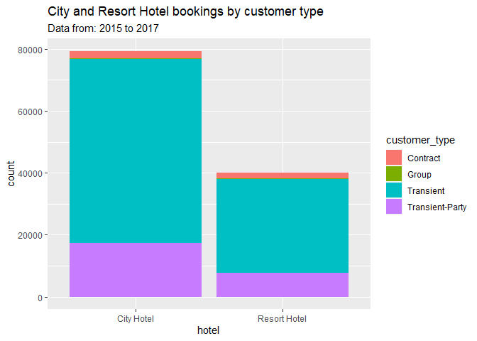<!-- -->

Transient customer type is more common to both city and resort hotels,
recording 75% of customers. Customers in groups are the least for both
hotels.  

Question 4. Which month between the year 2015 and 2017 has the highest
number of bookings.  

``` r
month_year <- bookings_df %>%
  filter(is_canceled == 0) %>%
  group_by(arrival_date_month) %>%
  summarise(count = n()) %>%
  arrange(desc(count))
month_year
```

    ## # A tibble: 12 × 2
    ##    arrival_date_month count
    ##    <chr>              <int>
    ##  1 August              8638
    ##  2 July                7919
    ##  3 May                 7114
    ##  4 October             6914
    ##  5 March               6645
    ##  6 April               6565
    ##  7 June                6404
    ##  8 September           6392
    ##  9 February            5372
    ## 10 November            4672
    ## 11 December            4409
    ## 12 January             4122

August is the month with the highest number of bookings from 2015 to
2017.  

``` r
ggplot(data=bookings_df) + geom_bar(mapping=aes(x=arrival_date_year, fill = hotel)) + facet_wrap(~arrival_date_month) + labs(title = "Bookings across months of the year from 2015 to 2017 ") 
```

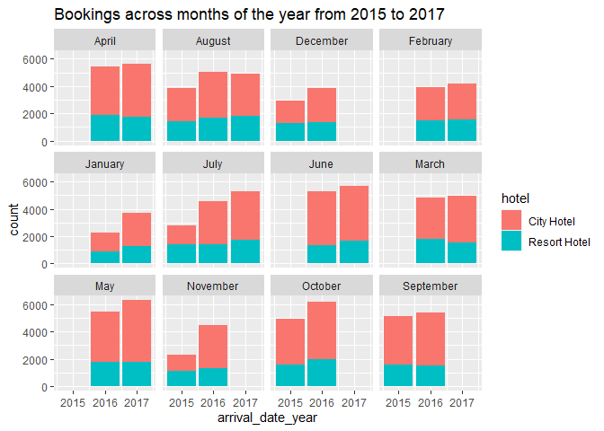<!-- -->

Some months bookings were not recorded. Winter months in general record
low bookings.  

Question 5. Top 8 countries with the highest bookings from 2015 to
2017.  

``` r
country_type <- select(bookings_df, hotel, country) %>%
  group_by(country) %>% count(country) %>% arrange(desc(n))
head(country_type, 8)
```

    ## # A tibble: 8 × 2
    ## # Groups:   country [8]
    ##   country     n
    ##   <chr>   <int>
    ## 1 PRT     48590
    ## 2 GBR     12129
    ## 3 FRA     10415
    ## 4 ESP      8568
    ## 5 DEU      7287
    ## 6 ITA      3766
    ## 7 IRL      3375
    ## 8 BEL      2342

``` r
top_8_countries <- subset(bookings_df, country == c("PRT", "GBR", "FRA", "ESP", "DEU", "ITA", "IRL", "BEL")) %>% select(country, hotel, arrival_date_month,customer_type)
```

    ## Warning in country == c("PRT", "GBR", "FRA", "ESP", "DEU", "ITA", "IRL", :
    ## longer object length is not a multiple of shorter object length

``` r
#plot of different nationalities and the month they visited city and resort hotels
ggplot(data=top_8_countries) + geom_bar(mapping=aes(x=country, fill = hotel), color="purple") + 
  facet_wrap(~arrival_date_month) +
  labs(title = " Top 8 countries and number of bookings",subtitle = "Plot showing bookings of top 8 countries in different months of the year 2015 to 2017") 
```

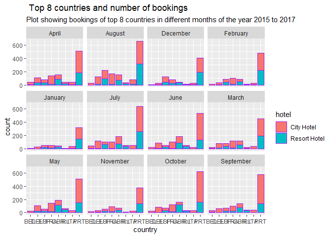<!-- -->

``` r
ggplot(data=top_8_countries) + geom_bar(mapping=aes(x=country, fill=hotel)) + coord_polar(theta = "y") +
  labs(title = "Pie chart showing bookings of top 8 countries by hotel")
```

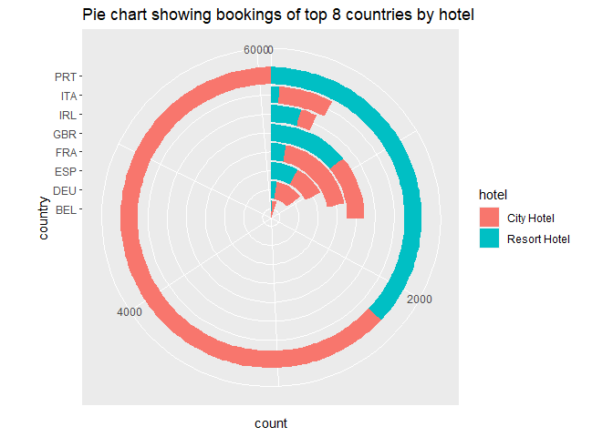<!-- -->

The top 8 countries with the highest number of bookings are Portugal,
Great Britain, France, Spain, Germany, Italy, Ireland, Belgium with
Portugal recording the highest.  

``` r
all_nights <- bookings_df %>% 
  select(hotel, adr, stays_in_weekend_nights, stays_in_week_nights) %>%
  mutate(total_nights = stays_in_weekend_nights + stays_in_week_nights, total_price = adr * total_nights)

avg_price <- all_nights %>%
  group_by(hotel) %>%
  summarize(price_sum = sum(total_price), average_price_per_booking = mean(total_price))
head(avg_price)
```

    ## # A tibble: 2 × 3
    ##   hotel        price_sum average_price_per_booking
    ##   <chr>            <dbl>                     <dbl>
    ## 1 City Hotel   25279470.                      319.
    ## 2 Resort Hotel 17444028.                      435.

Resort hotel has more average price per booking compared to City hotel.
This could be a reason why customers patronize City hotel more.  

Plot of market segments of city and resort hotel.  

``` r
ggplot(data=bookings_df) + geom_bar(mapping=aes(x=hotel)) +
  facet_wrap(~market_segment) + labs(title = "Market Segments of City and Resort Hotel")
```

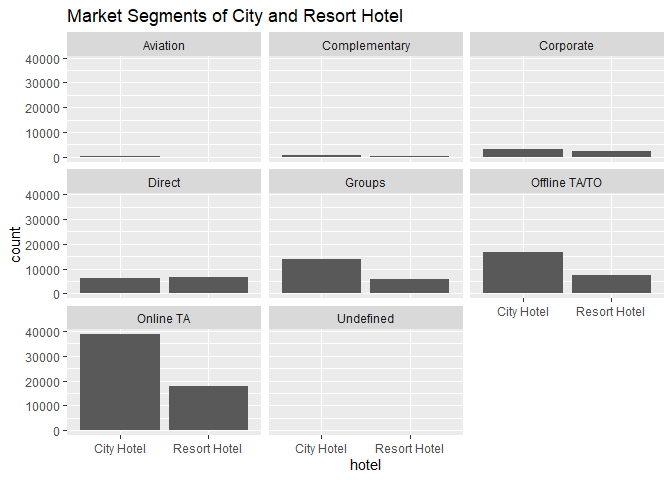<!-- -->

Both hotels have Online TA as its main market segment.  

``` r
ggplot(data=bookings_df) + geom_bar(mapping=aes(x=market_segment, fill=hotel)) + coord_polar(theta = "y") + 
  labs(title = "Pie chart of Market Segments by hotel")
```

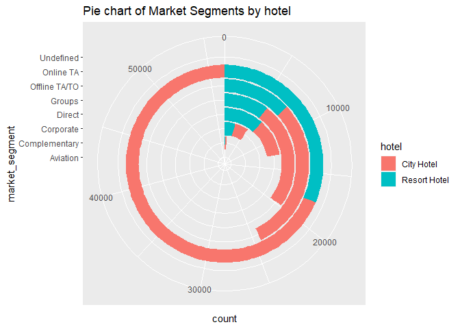<!-- -->

Plot of market segments of city and resort hotel by distribution
channel.  

``` r
ggplot(data=bookings_df) + geom_bar(mapping=aes(x=hotel, fill= distribution_channel)) +
  facet_wrap(~market_segment) + labs(title = "Market Segments of City and Resort Hotel by Distribution Channels")
```

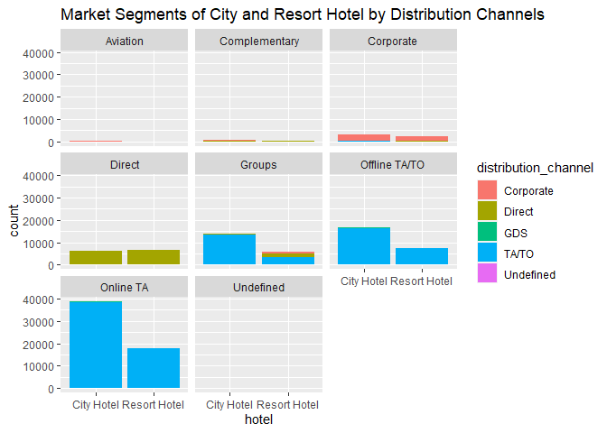<!-- -->

TA/TO is the major distribution channel in the Online TA segment for
both hotels.  

Plot of hotel by deposit type.  

``` r
ggplot(data=bookings_df) + geom_bar(mapping=aes(x=hotel, fill= deposit_type)) + labs(title = "Hotel bookings by deposit type")
```

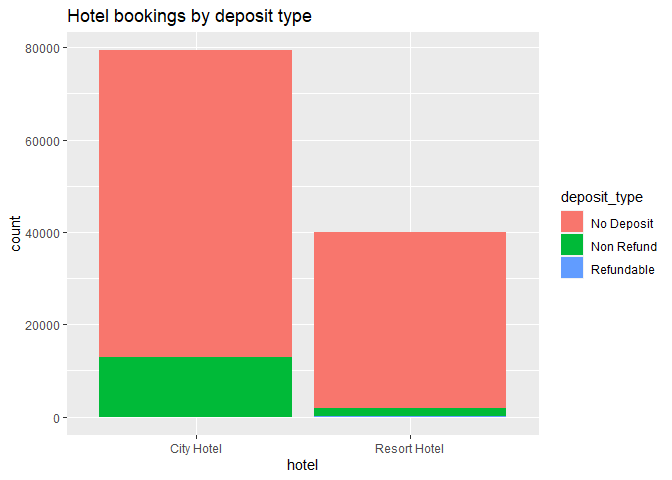<!-- -->

‘No deposit’ type is more prominent for the two hotels.  

Plot of previous cancellations and repeated guests.  
‘0’ represents not repeated guests while ‘1’ represents repeated
guests.  

``` r
ggplot(data=bookings_df) + geom_bar(mapping=aes(x=previous_cancellations)) +
  facet_wrap(~is_repeated_guest~hotel) + labs(title = "Previous Cancellations Vs Repeated Guest") 
```

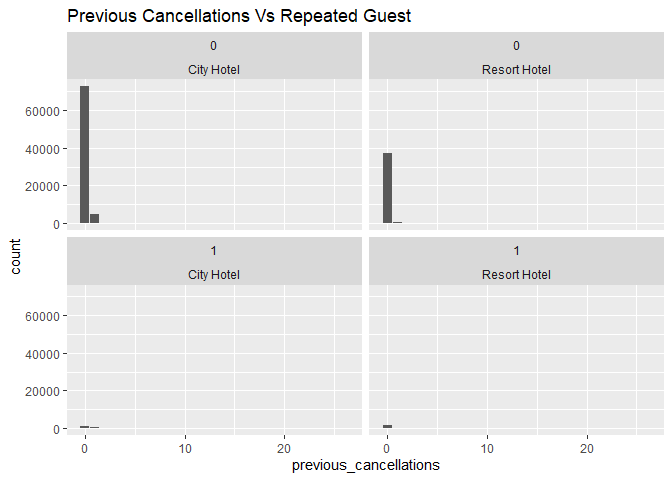<!-- -->

Only few customers that have made previous cancellations are repeated
guests in the city hotel and none repeat their visits in the resort
hotel.  

Plot of previous bookings not canceled and repeated guests.  

‘0’ represents not repeated guests while ‘1’ represents repeated
guests.  

``` r
ggplot(data=bookings_df) + geom_bar(mapping=aes(x=previous_bookings_not_canceled)) +
  facet_wrap(~is_repeated_guest~hotel) + labs(title = "Previous Bookings not Canceled Vs Repeated Guest") 
```

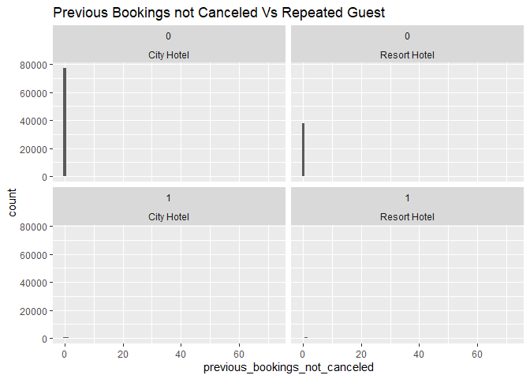<!-- -->

Number of mismatched rooms in reserved and assigned room type to
customers.  

``` r
mismatched_rooms <- bookings_df %>%
  filter(reserved_room_type != assigned_room_type) %>%
  nrow()
mismatched_rooms
```

    ## [1] 14917

Plot of reserved room and assigned room type to customers.  

``` r
ggplot(data=bookings_df) + geom_bar(mapping=aes(x=reserved_room_type, fill = assigned_room_type)) + facet_wrap(~hotel) +
  labs(title = "Reserved room Vs Assigned room", subtitle = "Reserved rooms in city and resort hotel and the rooms assigned") 
```

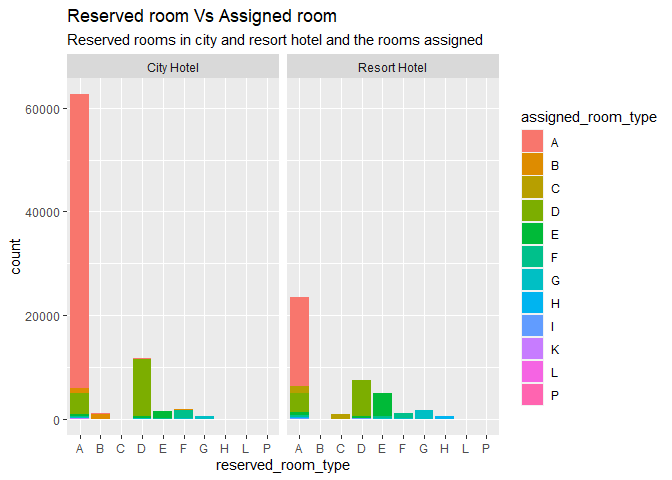<!-- -->

A high proportion of customers in resort hotel are assigned another room
aside what was reserved. For example, about 10 out of 35 customers that
reserved room A gets another room. In the case of city hotel, about 10
out of 125 customers are assigned another room aside the reserved room
A.  

# Summary and Conclusion

This work is mainly on exploring the hotel bookings dataset.  
City hotel records the highest average lead time of 109.7 and highest
cancellations, over 33,000.  
Despite having an average wait time of 3 days, many customers still book
for the City hotel.  
All customer types have a record of almost the same percentage for both
City and Resort hotel.  
August is the month with the highest number of bookings from 2015 to
2017.  
Portugal records the highest number of bookings. The hotels are situated
in Portugal which makes it reasonable.  
The Resort hotel is obviously more costly than the City hotel
considering the average price per booking, giving room for more customer
bookings in the City hotel.  
The Online market segment is the major market for both hotels.  
A lot of mismatch in reserved and assigned room types is obvious in
resort hotels. Both City and Resort hotel adopts the ‘no deposit’
payment type. This could be a reason for major bookings cancellations.  
Only few customers that have made previous cancellations are repeated
guests in the city hotel and none repeat their visits in the Resort
hotel. Generally, most customers do not repeat their visits to City and
Resort hotel either they made previous cancellations or not. Both hotels
may need to look into factors that may be responsible for this, probably
the ‘no deposit’ booking type, to encourage keeping their customers.  

On a general note, customers are prone to patronizing the City hotel
compared to Resort hotel due to its proximity and easy access within the
city. People mainly visit Resort hotel for vacation purposes which may
be located outside the city.  
